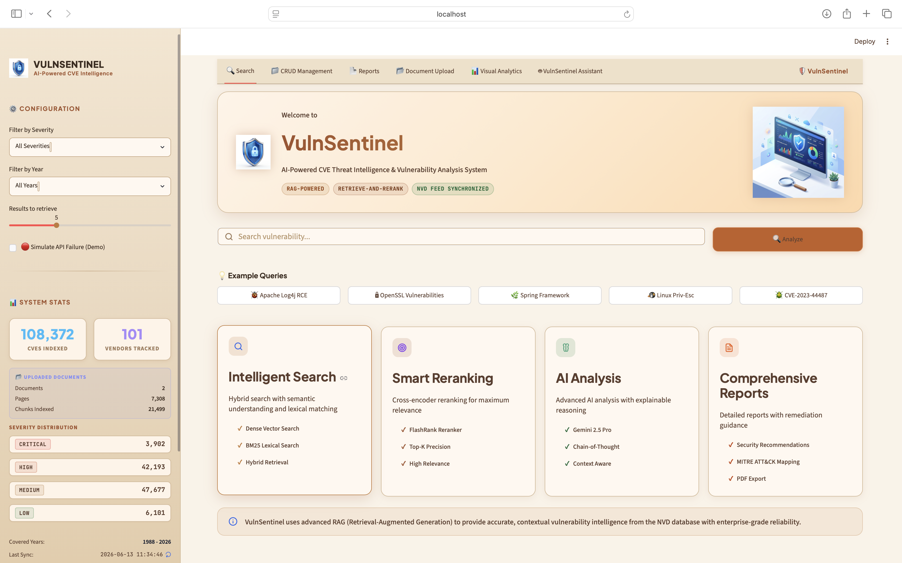
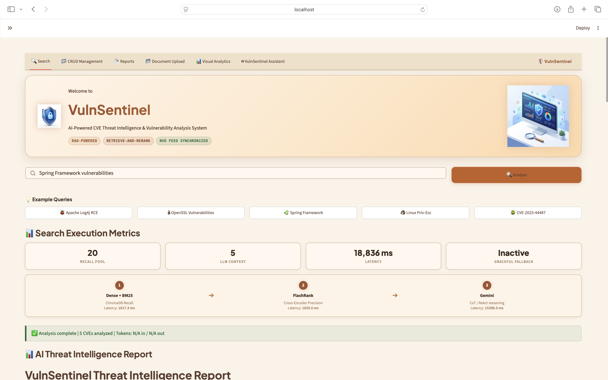
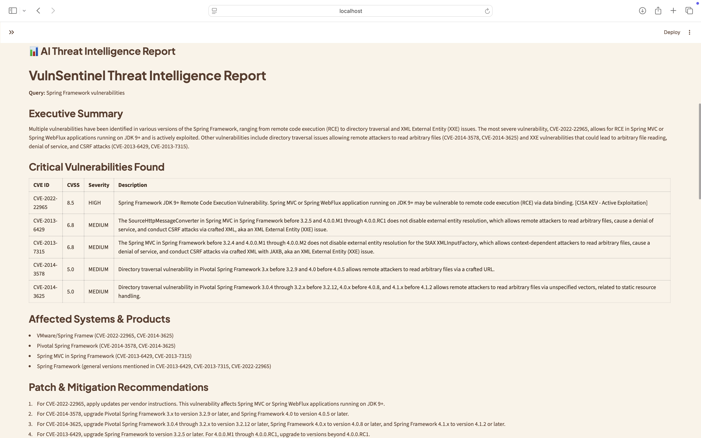
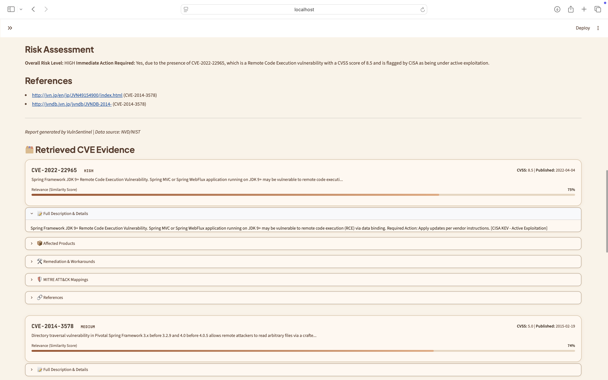
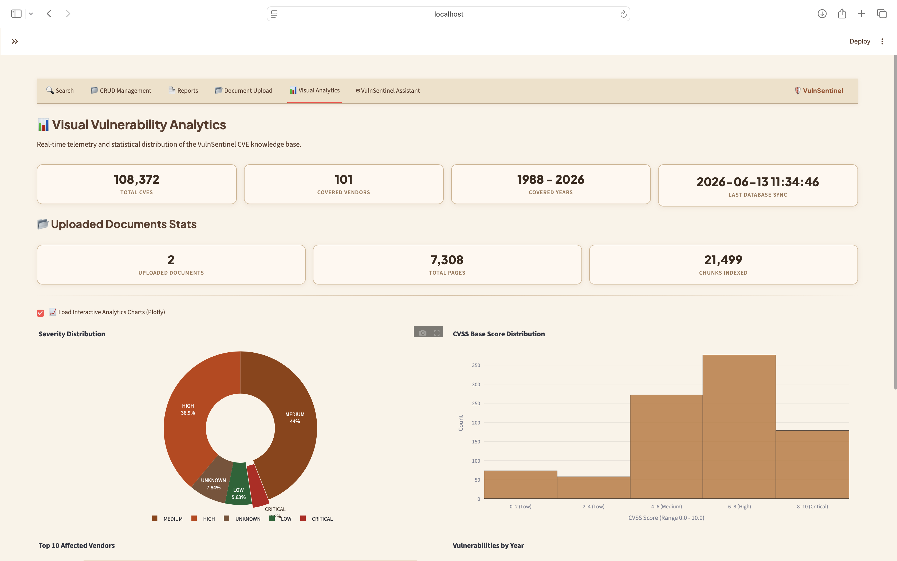
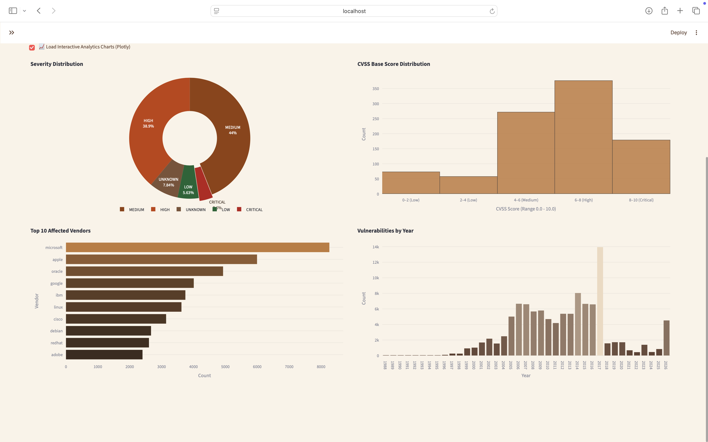
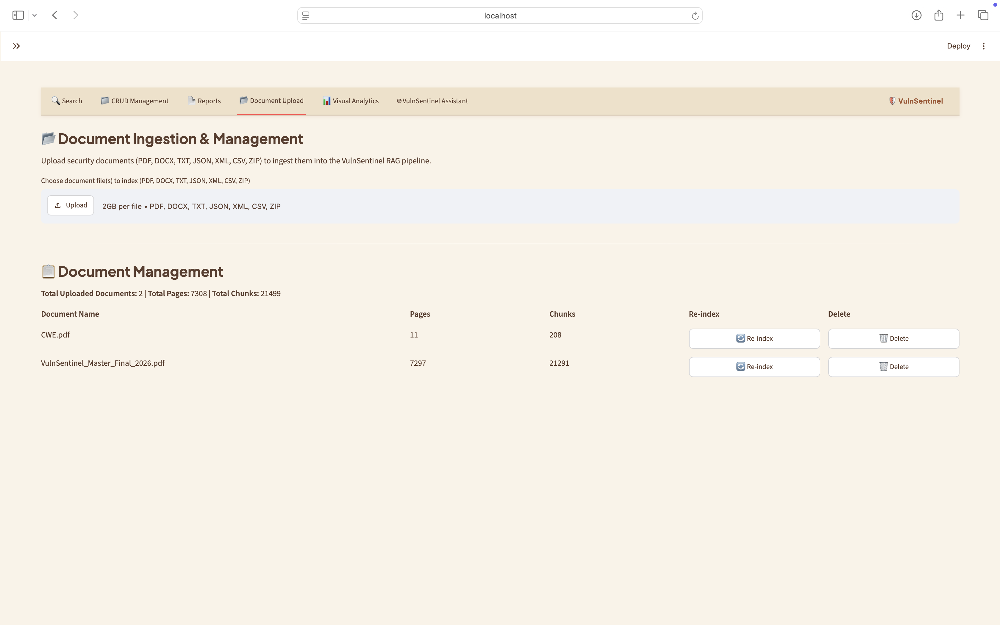
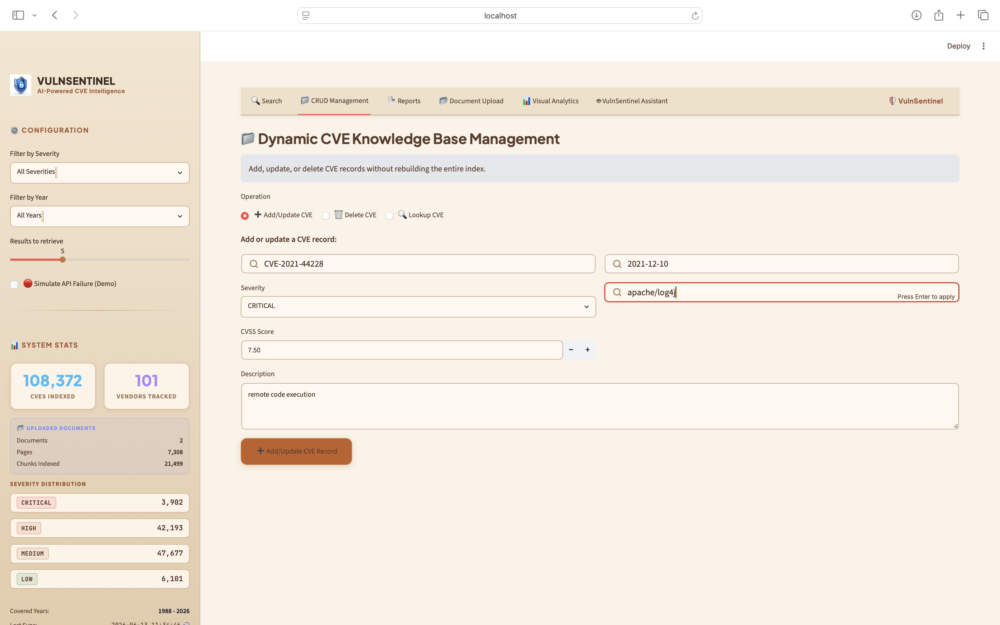
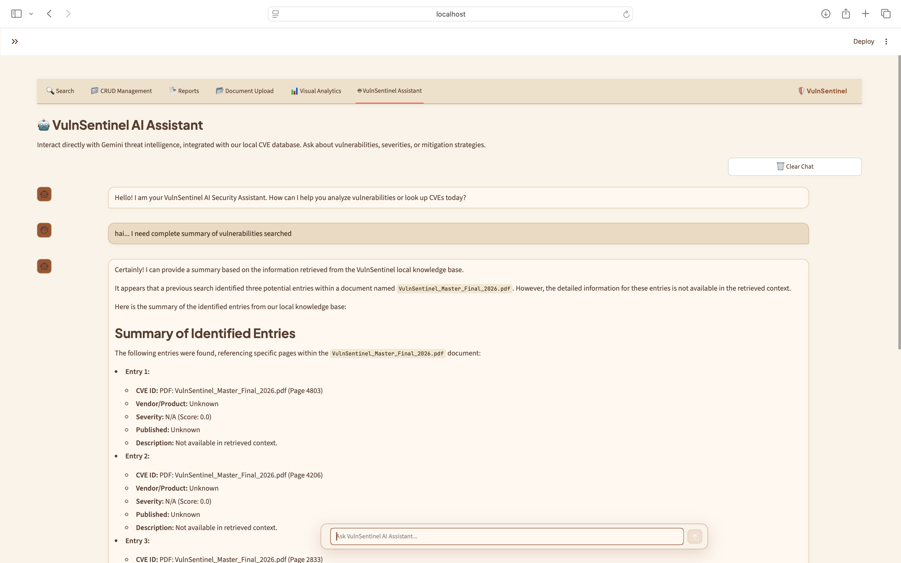
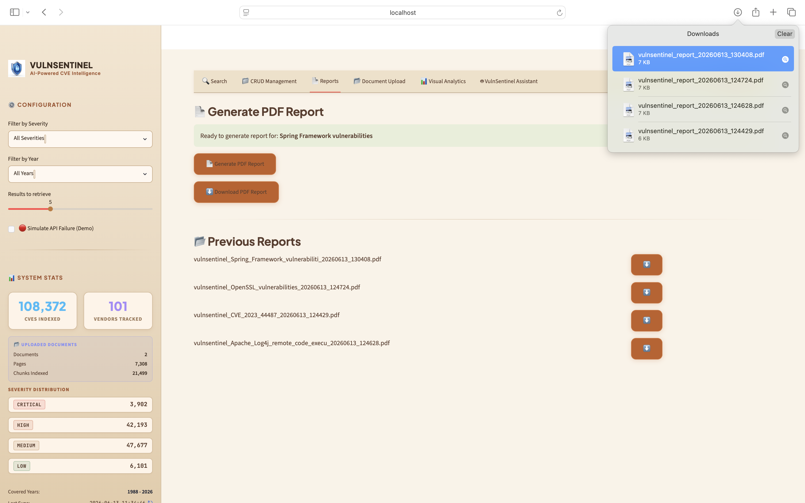

# 🛡️ VulnSentinel

<div align="center">

# Enterprise-Grade AI-Powered CVE Threat Intelligence Platform

### Retrieval-Augmented Generation (RAG) for Cybersecurity Vulnerability Analysis

Transforming **150,000+ CVE records** into structured, explainable, and evidence-backed threat intelligence reports.


### AI-Powered • Explainable • Retrieval-Augmented • Enterprise Ready

</div>

---

# 📖 Overview

VulnSentinel is an enterprise-grade cybersecurity vulnerability intelligence platform that leverages **Retrieval-Augmented Generation (RAG)** to transform raw CVE data into structured and explainable threat intelligence reports.

The application indexes more than **150,000 CVE records** from the National Vulnerability Database (NVD), performs hybrid retrieval and FlashRank reranking, and utilizes **Gemini 2.5 Flash** to generate actionable security insights.

Unlike generic chatbots, VulnSentinel is specifically designed for cybersecurity analysis and incorporates multiple guardrails to ensure factual, evidence-based responses.

---

# 🎯 Objectives

* Analyze vulnerabilities using CVE data.
* Generate structured threat intelligence reports.
* Provide mitigation and patch recommendations.
* Reduce hallucinations using RAG.
* Support dynamic database updates.
* Demonstrate enterprise-safe AI behavior.

---

# ✨ Features

## 🔍 Intelligent Hybrid Search

* Direct CVE-ID Lookup
* Semantic Vector Search
* Metadata Filtering
* Hybrid Retrieval Architecture

## 🔀 FlashRank Reranking

* Cross-Encoder Relevance Scoring
* Top-K Context Selection
* Reduced Noise
* Improved Accuracy

## 🧠 Advanced AI Reasoning

* Chain-of-Thought Prompting
* ReAct Framework
* Structured Threat Intelligence Reports

## 🛡 Input and Output Guardrails

### Input Guardrails

Protect against:

* Prompt Injection
* Jailbreak Attempts
* Exploit Requests
* Out-of-Domain Queries

### Output Guardrails

Ensure:

* Hallucination Detection
* CVE Validation
* Grounded Responses

## 📂 Multi-Format Document Ingestion

Supported formats:

* PDF
* DOCX
* TXT
* JSON
* XML
* CSV
* ZIP

## 🔄 Dynamic CRUD Operations

* Add Records
* Update Records
* Delete Records
* Lookup Existing Entries

## 📄 PDF Report Generation

Generate reports containing:

* Executive Summary
* Severity Analysis
* Impact Assessment
* CVE References
* Mitigation Recommendations

---

# 🏗 System Architecture

```text
                           User Query
                                │
                                ▼
                      Input Guardrails
                                │
                                ▼
                     Hybrid Retrieval Engine
                   ├── Direct CVE Lookup
                   └── Vector Search
                                │
                                ▼
                       FlashRank Reranker
                                │
                                ▼
                    CoT / ReAct Prompt Builder
                                │
                                ▼
                         Gemini 2.5 Flash
                                │
                                ▼
                      Output Guardrails
                                │
                                ▼
                 Structured Threat Intelligence Report
```

---

# 📸 Application Screenshots

## 🏠 Landing Dashboard



---

## 🔍 Threat Intelligence Search

### Search Interface



### Retrieved CVE Results



### Generated Threat Intelligence Report



---

## 📊 Analytics Dashboard





---

## 📁 Document Upload and Indexing



---

## 🔄 Dynamic CRUD Operations



---

## 🤖 AI Assistant



---

## 📄 Generated PDF Report



---

# ⚡ Performance Highlights

* 150,000+ Indexed CVEs
* Hybrid Retrieval Architecture
* FlashRank Cross-Encoder Reranking
* Gemini 2.5 Flash Integration
* Hallucination Detection
* Dynamic CRUD Operations
* Multi-Format Document Support
* Graceful API Failover
* Interactive Analytics Dashboard

---

# 🛠 Technology Stack

## Backend

* Python 3.11
* FastAPI
* Uvicorn

## Frontend

* Streamlit
* Plotly
* Custom CSS

## Vector Database

* ChromaDB
* SQLite

## Machine Learning & NLP

### Embedding Model

* BAAI/bge-small-en-v1.5

### Cross-Encoder Reranker

* ms-marco-MiniLM-L-12-v2

### Large Language Model

* Gemini 2.5 Flash

---

# 📁 Project Structure

```text
vulnsentinel/
├── app.py                   # Main Streamlit web dashboard application
├── api.py                   # FastAPI backend server
├── requirements.txt         # Python project dependencies
├── setup_mac.sh             # Installation and virtual environment setup script
├── pyrefly.toml             # Configuration settings
├── test_gemini.py           # LLM API connection test script
├── ingest/                  # Data ingestion, parsing, and indexing
│   ├── indexer.py           # ChromaDB indexer and statistics generator
│   ├── parser.py            # NVD JSON feed vulnerability parser
│   ├── pdf_processor.py     # PDF, DOCX, and text document processor
│   ├── downloader.py        # NVD CVE feed archive downloader
│   ├── cwe_parser.py        # CWE hierarchy parser
│   ├── capec_parser.py      # CAPEC attack pattern parser
│   ├── attack_parser.py     # MITRE ATT&CK enterprise techniques parser
│   └── kev_parser.py        # CISA Known Exploited Vulnerabilities parser
├── retrieval/               # Search and retrieval operations
│   ├── vector_search.py     # Hybrid search and regex CVE lookup engine
│   └── reranker.py          # FlashRank cross-encoder reranking client
├── pipeline/                # RAG pipeline orchestration
│   ├── rag_engine.py        # Core RAG flow coordinator
│   ├── guardrails.py        # Dual-layer safety checks (input and output)
│   └── prompts.py           # Chain-of-Thought (CoT) system prompts
├── fallback/                # Fault tolerance and high availability
│   └── degradation.py       # Offline mode fallback and failure simulation
├── output/                  # Document and report output
│   └── report_gen.py        # Professional PDF security advisory generator
├── utils/                   # General utility modules
│   └── document_formatter.py # Text preprocessing and extraction formatter
├── static/                  # UI assets and configuration
│   ├── custom.css           # Streamlit interface styling custom overrides
│   ├── shield_logo.png      # VulnSentinel platform logo
│   └── monitor_dashboard.png # Landing page vector illustration
├── assets/                  # Application interface screenshots
│   ├── dashboard.png
│   ├── search.png
│   ├── search1.png
│   ├── search2.png
│   ├── analytics.png
│   ├── analytics2.png
│   ├── upload.png
│   ├── crud.png
│   ├── ai_assistant.png
│   └── report.png
├── tests/                   # Automated validation suite
│   ├── test_api.py
│   ├── test_degradation.py
│   ├── test_guardrails.py
│   ├── test_indexer.py
│   ├── test_parser.py
│   ├── test_rag_engine.py
│   ├── test_reranker.py
│   ├── test_report_gen.py
│   └── test_vector_search.py
└── data/                    # Persistent storage (git-ignored)
    ├── chromadb/            # SQLite-backed Chroma vector store files
    ├── uploads/             # Indexable organization security documents
    └── reports/             # Generated PDF advisories cache
```

---

# 🚀 Installation

## Clone Repository

Clone the [vulnsentinel](https://github.com/sumathigowda891-source/vulnsentinel) repository:

```bash
git clone https://github.com/sumathigowda891-source/vulnsentinel.git

cd vulnsentinel
```

## Install Dependencies

```bash
chmod +x setup_mac.sh

./setup_mac.sh
```

## Download and Index CVE Data

```bash
source venv/bin/activate

python -m ingest.downloader

python -m ingest.indexer
```

## Start Application

```bash
streamlit run app.py
```

Open:

```text
http://localhost:8501
```

---

# 🚀 Future Enhancements

* CVSS v4 Support
* Multi-Agent Security Analysis
* Docker Deployment
* Kubernetes Scaling
* SIEM Integration
* Multi-LLM Support

---

# 🎥 Video Presentation

A video demonstration of the project is included with this repository.

The presentation explains:

* Application overview and purpose
* System prompt used
* Retrieval-Augmented Generation (RAG) architecture
* How the RAG system improves the application
* Why RAG was chosen for this project

### For Video Presentation click a link below

📹 https://drive.google.com/file/d/1KkaDzr872Nckg0ZmQdmRZK09ONAdL9f5/view?usp=sharing

---

# 📜 License

This project is distributed under the MIT License.

---

<div align="center">

# 🛡️ VulnSentinel

### Secure • Explainable • Retrieval-Augmented • Enterprise Ready

</div>
